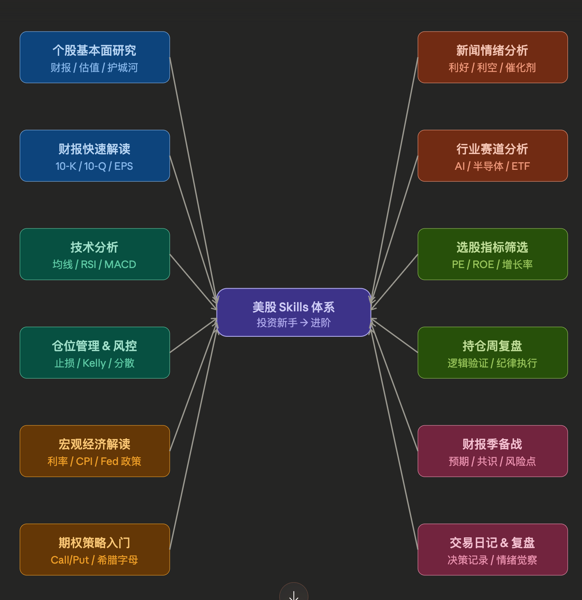

# Open Investor Skills

> A collection of Claude Skills for US stock market analysis —
> from fundamental research to earnings decoding to real-time news sentiment.


---

## What is this?

**open-investor-skills** is an open-source collection of [Claude Skills](https://docs.anthropic.com/en/docs/claude-code/skills) designed to make US stock market analysis faster, more structured, and more consistent.

Each Skill teaches Claude a professional analysis framework — so instead of asking Claude the same questions from scratch every time, you get a repeatable, high-quality workflow that triggers automatically.

> ⚠️ **Disclaimer**: All outputs are for educational and research purposes only.
> Nothing in this repository constitutes financial or investment advice.
> Always do your own due diligence before making any investment decisions.

---

## Skills Overview



| Skill | Trigger | Output |
|-------|---------|--------|
| [`stock-fundamental-research`](#-stock-fundamental-research) | "分析一下 NVDA" / "XX 值得买吗" | 四步个股研究报告（业务 + 财务 + 估值 + 护城河）|
| [`earnings-report-decoder`](#-earnings-report-decoder) | "帮我读这份财报" / "Q3 业绩怎么样" | 结构化财报解读笔记（10-K / 10-Q / 8-K）|
| [`news-sentiment-analyzer`](#-news-sentiment-analyzer) | "这条新闻是利好还是利空" | 情绪评分卡（-3 到 +3）+ 建议行动 |

### How they work together

```
一条新闻进来
      │
      ▼
news-sentiment-analyzer        ← 快速判断：信号还是噪音？评分 ≥ ±2？
      │
      ▼  （评分触发深入研究）
earnings-report-decoder        ← 读原始财报，验证数字
      │
      ▼  （重新评估基本面）
stock-fundamental-research     ← 完整估值 + 护城河分析，决定是否调仓
```

---

## Skills Detail

### 📊 stock-fundamental-research

对任意美股个股进行系统性基本面研究，覆盖四个维度：

| 步骤 | 内容 | 核心产出 |
|------|------|---------|
| 第一步 | 业务快照 | 商业模式、收入结构、增长驱动 |
| 第二步 | 财务质量 | 盈利能力、成长性、健康度、红旗警示 |
| 第三步 | 估值分析 | 相对估值 + DCF 三情景价值区间 |
| 第四步 | 护城河评估 | Morningstar 五维框架打分 |

**自动输出**：研究报告 `.md` + `.pdf`，可选 Gmail 发送。

**参考文件**：
- `references/financial-metrics.md` — 各指标优秀/及格/警戒线标准
- `references/valuation-methods.md` — DCF 详细计算步骤
- `references/sector-benchmarks.md` — 10+ 行业估值基准

**触发示例**：
```
分析一下 NVDA 的基本面
AAPL 现在估值合理吗？
帮我研究一下 MSFT，看看值不值得长期持有
```

---

### 📋 earnings-report-decoder

解读 SEC 财报文件，覆盖 10-K / 10-Q / 8-K / 电话会议四种格式。
**核心价值**：告诉你去哪里找、找什么、怎么判断好坏。

| 文件类型 | 核心解读框架 |
|---------|------------|
| 10-K 年报 | 必读章节地图 → MD&A 四大重点 → 三表快速扫描 |
| 10-Q 季报 | 5 分钟速读框架：结果 vs 预期 → 变化解释 → 现金流 |
| 8-K 重大公告 | 17 种 Item 类型速查 + 60 秒判断法 |
| 电话会议 | 管理层陈述要点 + Q&A 信号识别 |

**自动输出**：财报解读笔记 `.md` + `.pdf`，可选 Gmail 发送。

**参考文件**：
- `references/three-statements.md` — 三张报表逐行拆解 + 联动关系
- `references/non-gaap-guide.md` — Non-GAAP 调整项识别与陷阱
- `references/sec-edgar-howto.md` — SEC EDGAR 导航手册

**触发示例**：
```
NVDA 最新季报出来了，帮我解读一下
这份 10-K 的 MD&A 说了什么重要的？（上传 PDF）
META 这季度 beat 了吗？下季度指引怎么样？
```

---

### 📰 news-sentiment-analyzer

快速判断新闻对股价的影响方向和持续时间，输出标准化情绪评分卡。

**7 种新闻框架**：

| 框架 | 类型 | 核心判断逻辑 |
|------|------|------------|
| A | 财务业绩 | 结果 vs 预期 × 指引 vs 预期 × KPI 趋势 |
| B | 业务事件 | 并购溢价合理性 / 合同金额占比 / 产品 TAM |
| C | 监管政策 | 四级严重程度（实质影响 vs 情绪冲击）|
| D | 宏观经济 | 利率敏感度 × 行业属性映射 |
| E | 行业动态 | 竞争格局变化 / 供应链传导链 |
| F | 高管人事 | 突然离职信号解读 / 内部人交易分析 |
| G | 市场情绪 | 分析师评级 / 做空报告可信度 / meme 风险 |

**情绪评分**：`-3`（强烈利空）到 `+3`（强烈利好），统一标准便于跨时间比较。

**自动输出**：情绪分析报告 `.md` + `.pdf`（配色随评分变化），可选 Gmail 发送。

**参考文件**：
- `references/sector-sensitivity.md` — 各行业对不同新闻的敏感度矩阵
- `references/historical-patterns.md` — 历史同类事件市场反应规律
- `references/source-credibility.md` — 新闻来源可信度分级 + 工具推荐

**触发示例**：
```
Adobe CEO 突然离职，这条新闻怎么看？
帮我看看今天美股有哪些重要消息，逐条分析
Fed 加息预期上升对我持有的科技股影响大吗？
```

---

## Installation

### 1. 安装 Claude Code CLI

```bash
npm install -g @anthropic-ai/claude-code
```

### 2. 克隆本仓库

```bash
git clone https://github.com/YOUR_USERNAME/open-investor-skills.git
```

### 3. 验证安装

```bash
claude
> /context    # 查看已加载的 Skills 列表
```

---

## Usage Examples

### 基础用法：直接对话触发

```bash
claude

# 个股研究
> 帮我研究一下 NVDA，看看现在值不值得买

# 财报解读
> AAPL Q1 2026 财报出来了，帮我解读一下

# 新闻分析
> 今天 Adobe CEO 宣布离职，这对 ADBE 股价影响大吗？
```

---

## Output Structure

每次分析自动在当前目录的 `output/` 下生成文件：

```
output/
├── NVDA_research_20260314.md          # 个股研究报告（Markdown）
├── NVDA_research_20260314.pdf         # 个股研究报告（PDF）
├── AAPL_10Q_2026Q1_20260314.md        # 财报解读笔记（Markdown）
├── AAPL_10Q_2026Q1_20260314.pdf       # 财报解读笔记（PDF）
├── ADBE_news_20260314_1430.md         # 新闻情绪报告（Markdown）
└── ADBE_news_20260314_1430.pdf        # 新闻情绪报告（PDF，配色随评分变化）
```


## License

MIT License — free to use, modify, and distribute.
See [LICENSE](LICENSE) for details.

---

## Acknowledgements

Built with [Claude](https://claude.ai) by Anthropic.
Investment frameworks inspired by Warren Buffett, Charlie Munger, and the Morningstar moat methodology.

> *"The stock market is a device for transferring money from the impatient to the patient."*
> — Warren Buffett
